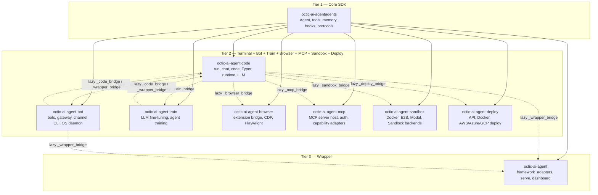
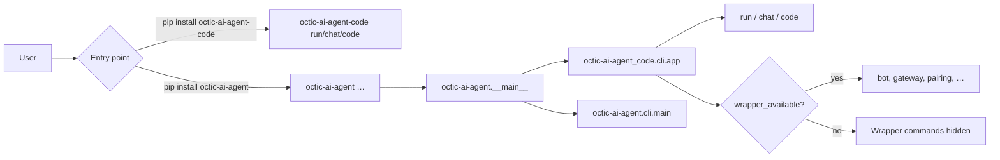
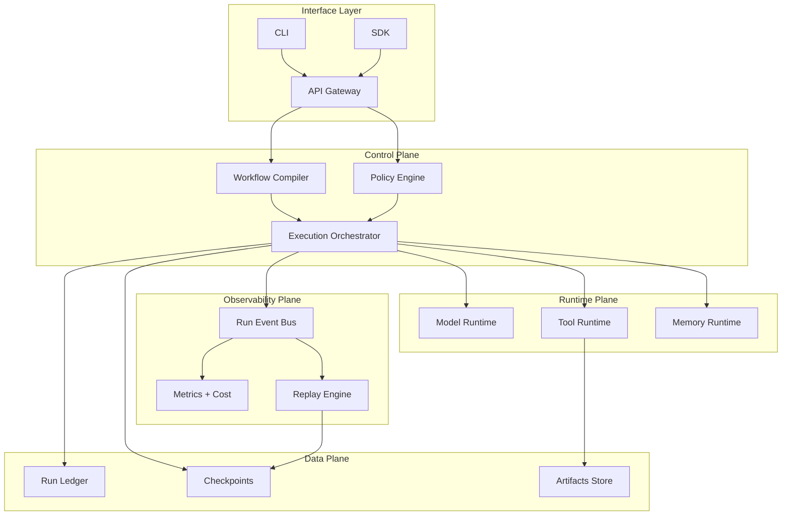
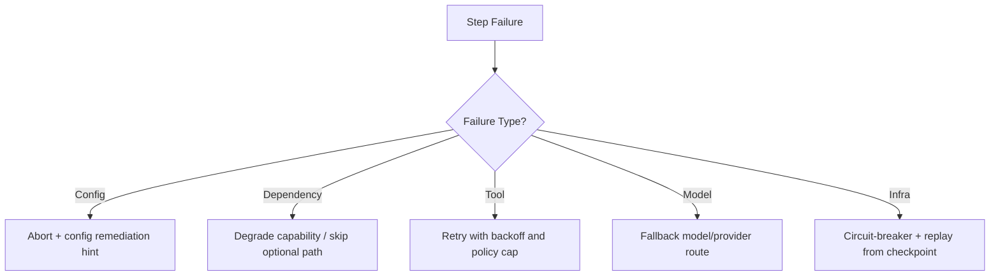
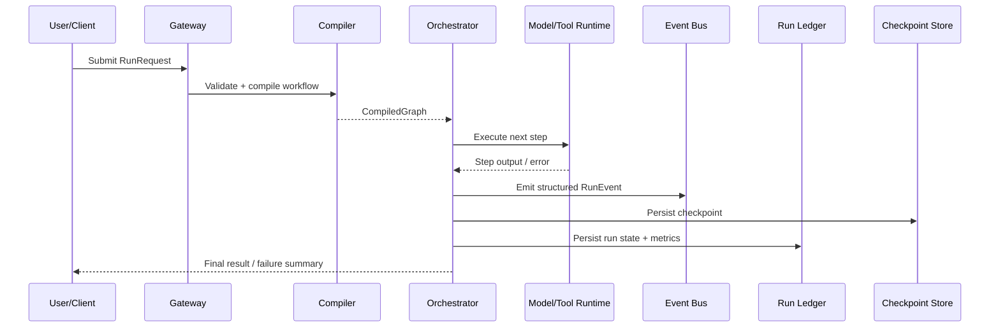
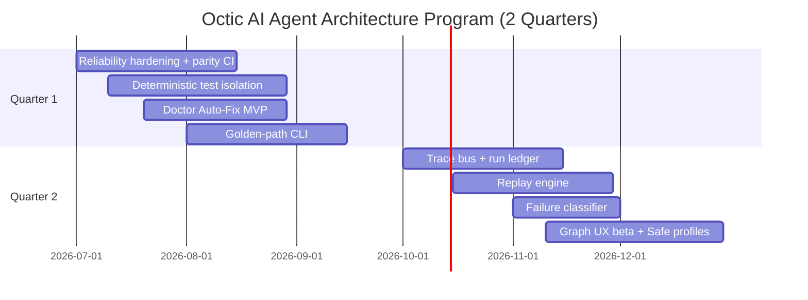

# Octic AI Agent Architecture

> **Last updated:** 2026-07-31 (C14 — nine-package tiered model)
>
> Strategic architecture document for Octic AI Agent — a multi-agent AI framework.
> Covers **Python tiered package model (C7.1 + C9 + C10)**, system design, runtime
> architecture, data contracts, reliability, observability, and the road map.

---

## Table of Contents

1. [Executive Summary](#1-executive-summary)
2. [Python Tiered Package Model (C7.1 + C9 + C10 + C11 + C12 + C13 + C14)](#2-python-tiered-package-model-c71--c9--c10--c11--c12--c13--c14)
3. [System Overview](#3-system-overview)
4. [Layered Architecture](#4-layered-architecture)
5. [Core Data Contracts](#5-core-data-contracts)
6. [Reliability by Design](#6-reliability-by-design)
7. [Observability & Telemetry](#7-observability--telemetry)
8. [Replay & Checkpointing](#8-replay--checkpointing)
9. [Implementation Roadmap](#9-implementation-roadmap)
10. [Success Metrics](#10-success-metrics)

**Related boundary docs:** [`src/octic-ai-agent/tests/C7.1_BOUNDARIES.md`](src/octic-ai-agent/tests/C7.1_BOUNDARIES.md) · [`src/octic-ai-agent/tests/C9.1_BOUNDARIES.md`](src/octic-ai-agent/tests/C9.1_BOUNDARIES.md) · [`src/octic-ai-agent/tests/OCTIC_AI_AGENT_TRAIN_MANIFEST.md`](src/octic-ai-agent/tests/OCTIC_AI_AGENT_TRAIN_MANIFEST.md) · [`src/octic-ai-agent/tests/OCTIC_AI_AGENT_BROWSER_MANIFEST.md`](src/octic-ai-agent/tests/OCTIC_AI_AGENT_BROWSER_MANIFEST.md) · [`src/octic-ai-agent/tests/OCTIC_AI_AGENT_MCP_MANIFEST.md`](src/octic-ai-agent/tests/OCTIC_AI_AGENT_MCP_MANIFEST.md) · [`src/octic-ai-agent/tests/C7_VERIFICATION.md`](src/octic-ai-agent/tests/C7_VERIFICATION.md) · [`src/octic-ai-agent/tests/C9_VERIFICATION.md`](src/octic-ai-agent/tests/C9_VERIFICATION.md) · [`src/octic-ai-agent-agents/AGENTS.md`](src/octic-ai-agent-agents/AGENTS.md) §2.4

---

## 1. Executive Summary

Octic AI Agent is a multi-agent AI framework with broad capability surface across
Python, TypeScript, and Rust SDKs. The framework's core strength is its
feature breadth — agent abstractions, integrations, workflows, and active
release cadence.

The strategic bet for the next two quarters is building a **Reliability + 
Orchestration + Observability** core to unlock adoption and trust:

| Dimension | Current State | Target |
|-----------|--------------|--------|
| Reliability | Cross-platform mismatches, optional dep fragility | Deterministic gating, adapter abstraction, parity CI |
| Determinism | Flaky tests, global state collisions | Isolated test fixtures, traceable tenant IDs |
| Developer UX | Complex onboarding, implicit config | Golden-path CLI, Doctor Auto-Fix |
| Observability | Minimal runtime tracing | Structured event bus, replay engine, failure classifier |

### Design Principles

- **Deterministic by default**, flexible by opt-in
- **Policy-enforced execution boundaries** at every layer
- **Structured events** for all lifecycle transitions
- **Capability isolation** per agent and per tool

---

## 2. Python Tiered Package Model (C7.1 + C9 + C10 + C11 + C12 + C13 + C14)

**Release:** v4.6.110+ · `octic-ai-agentagents` · `octic-ai-agent-code` · `octic-ai-agent-bot` · `octic-ai-agent-train` · `octic-ai-agent-browser` · `octic-ai-agent-mcp` · `octic-ai-agent-sandbox` · `octic-ai-agent-deploy` · `octic-ai-agent`

The Python monorepo publishes nine packages in three tiers with strict dependency
direction. C7 delivered a standalone agentic hot path; C7.1 formalised
code/wrapper ownership; C9 extracted bots, gateway, and channel CLI into
`octic-ai-agent-bot`; C10 extracted LLM fine-tuning and agent training into
`octic-ai-agent-train`; C11 extracted browser automation into `octic-ai-agent-browser`;
C12 extracted the heavy MCP host into `octic-ai-agent-mcp`.
C13 extracted sandbox backends into `octic-ai-agent-sandbox`.
C14 extracted deployment (API, Docker, cloud) into `octic-ai-agent-deploy`.



**PyPI publish order:** `octic-ai-agentagents` → `octic-ai-agent-code` + `octic-ai-agent-bot` + `octic-ai-agent-train` + `octic-ai-agent-browser` + `octic-ai-agent-mcp` + `octic-ai-agent-sandbox` + `octic-ai-agent-deploy` → `octic-ai-agent`

**Backward compatibility:** `octic-ai-agent.bots`, `octic-ai-agent.gateway`, `octic-ai-agent.train`,
`octic-ai-agent.browser`, `octic-ai-agent.mcp_server`, `octic-ai-agent.sandbox`, `octic-ai-agent.deploy`, and related CLI paths remain as
`alias_package` shims to `octic-ai-agent_bot.*` / `octic-ai-agent_train.*` /
`octic-ai-agent_browser.*` / `octic-ai-agent_mcp.*` / `octic-ai-agent_sandbox.*` / `octic-ai-agent_deploy.*`.

| Tier | Package | Owns | Must not depend on |
|------|---------|------|-------------------|
| 1 | `src/octic-ai-agent-agents/` | Agent, tools, memory, hooks, `frameworks/` protocols, sandbox protocols | `octic-ai-agent`, `octic-ai-agent-code`, `octic-ai-agent-bot`, `octic-ai-agent-train`, `octic-ai-agent-browser`, `octic-ai-agent-mcp`, `octic-ai-agent-sandbox`, `octic-ai-agent-deploy` |
| 2a | `src/octic-ai-agent-code/` | `run`/`chat`/`code`, Typer, runtime, LLM, tool resolution | **`octic-ai-agent` as a PyPI dependency** (optional lazy imports via `_wrapper_bridge` only) |
| 2b | `src/octic-ai-agent-bot/` | Bots, gateway, channel CLI, OS daemon, gateway scheduler tick | **`octic-ai-agent` as a PyPI dependency** (optional lazy `_wrapper_bridge` for jobs/UI) |
| 2c | `src/octic-ai-agent-train/` | LLM fine-tuning (Unsloth), agent training, `train` CLI, conda env setup | **`octic-ai-agent` as a PyPI dependency** (lazy `_code_bridge` for legacy dispatch) |
| 2d | `src/octic-ai-agent-browser/` | Extension bridge, CDP/hybrid automation, `browser` CLI | **`octic-ai-agent` as a PyPI dependency** (none required; depends on `octic-ai-agentagents` only) |
| 2e | `src/octic-ai-agent-mcp/` | MCP server host, auth, transports, `mcp` CLI | **`octic-ai-agent` as a PyPI dependency** (lazy `_wrapper_bridge` for full capability registry) |
| 2f | `src/octic-ai-agent-sandbox/` | Sandbox backends (Docker, E2B, Modal, Sandlock, SSH), `SandboxRegistry` | **`octic-ai-agent` as a PyPI dependency** (lazy `_code_bridge` for `PluginRegistry`) |
| 2g | `src/octic-ai-agent-deploy/` | Deploy API/Docker/cloud, `deploy` CLI, scheduler integration | **`octic-ai-agent` as a PyPI dependency** (lazy `_plugin_registry` via `_code_bridge`) |
| 3 | `src/octic-ai-agent/` | `framework_adapters/`, serve, dashboard, async jobs API | — |

### Repo infra (not PyPI)

Deployment packaging that stays in the git checkout, not in any tier-2 wheel:

| Path | Runtime owner | Orchestration |
|------|---------------|---------------|
| `src/octic-ai-agent-bot/infra/helm/octic-ai-agent-gateway/` | `octic-ai-agent-bot` (gateway) | C14 `deploy helm` wrapper |
| `src/octic-ai-agent-deploy/infra/helm/octic-ai-agent-agents-api/` | Generated API from C14 | C14 cross-link |
| `src/octic-ai-agent-deploy/infra/compose/agents-stack/` | Docker Compose | `octic-ai-agent deploy compose up/down` |
| `src/octic-ai-agent-deploy/infra/starters/` | Starter scaffolds | `octic-ai-agent deploy create --template` |
| `docker/` | Mixed (wrapper/bot dev stacks) | Not C14 — see bot manifest for `docker/bots/` |

Same boundary as C14: Helm/K8s manifests are **repo infra**, not `pip install octic-ai-agent-deploy` content.

**Config kernel:** Phase 0 `octic-ai-agent/common/` was skipped; shared config lives in
`octic-ai-agent_code/cli/configuration/` and is reached by the bot tier via lazy
`_code_bridge` (see `src/octic-ai-agent/tests/CONFIG_KERNEL.md`).

### Dependency rule (validated)

| Question | Answer |
|----------|--------|
| Does `octic-ai-agent-code` declare `octic-ai-agent` in `pyproject.toml`? | **No** — only `octic-ai-agentagents` + CLI/runtime deps |
| Does `octic-ai-agent` declare `octic-ai-agent-code`? | **Yes** — one-way chain, no PyPI cycle |
| Can `octic-ai-agent-code` import `octic-ai-agent.*` at runtime? | **Only lazily** via `octic-ai-agent_code._wrapper_bridge` for optional features; **not** on the agentic hot path |
| Does standalone `pip install octic-ai-agent-code` work? | **Yes** — CI smoke validates imports + `octic-ai-agent-code run` without the wrapper |

### CLI routing



### Import gates (CI enforced)

- **Hot path:** no module-level `from octic-ai-agent` in `main.py`, `app.py`, `run.py`, `chat.py`, `code.py`
- **Regression baseline:** 50 direct wrapper import lines max (`scripts/check_c7_imports.sh`; C8 achieved **0**)
- **Allowlist:** reviewed files only (`scripts/c7_wrapper_import_allowlist.txt`; empty post-C8)
- **Hybrid audit:** `scripts/audit_hybrid_modules.py` — repatriated cross-tier import paths

### C7 / C7.1 / C8 status

| Milestone | Status |
|-----------|--------|
| Standalone agentic hot path | **Complete** |
| `_wrapper_bridge` hardening | **Complete** |
| Import gate + allowlist | **Complete** |
| Boundary tests + CI smoke | **Complete** |
| C8 reverse import elimination (225 → 0 direct imports) | **Complete** — see [`C8_BACKLOG.md`](src/octic-ai-agent/tests/C8_BACKLOG.md) |
| C8.4 main.py physical decomposition | **Deferred** (separate epic) |
| PyPI package splits (`octic-ai-agent-bot`, etc.) | **Out of scope** |

---

## 3. System Overview

```
User/SDK/CLI
  → Workflow Compiler (graph + policy + schemas)
    → Execution Orchestrator (state machine, retries, fallbacks)
      → Tool Runtime (sandbox + approval + capability scope)
      → Model Runtime (provider abstraction + rate/timeout policy)
    → Observability Bus (trace events + metrics + cost)
    → Replay Engine (checkpoint + deterministic re-run)
    → Persistence (session, memory, artifacts, run ledger)
```

### Runtime Components

| Component | Responsibility | Interface |
|-----------|---------------|-----------|
| API/CLI Gateway | Accepts run requests, validates config/profile | `RunRequest`, `RunProfile` |
| Workflow Compiler | Converts YAML/DSL to normalized execution graph | `CompiledGraph` |
| Orchestrator | Executes graph state machine with retries/fallbacks | `ExecutionState`, `StepTransition` |
| Tool Runtime | Runs tools with approval/sandbox policies | `ToolCall`, `ToolResult` |
| Model Runtime | Provider routing, timeout, budget control | `ModelRequest`, `ModelResponse` |
| Observability Bus | Streams structured events + metrics | `RunEvent` schema |
| Replay Engine | Restarts from checkpoint with deterministic inputs | `ReplayRequest` |

### Existing Architecture (Python SDK)

The Python SDK is organised as three publishable tiers (see [§2](#2-python-three-tier-package-model-c71)):

- `src/octic-ai-agent-agents/` — Core SDK (`Agent`, tools, memory, hooks, protocols)
- `src/octic-ai-agent-code/` — Terminal CLI (`run`, `chat`, `code`, Typer, runtime, LLM)
- `src/octic-ai-agent/` — Wrapper (gateway, bots, `framework_adapters/`, integrations)

Core execution modules live in `octic-ai-agentagents`:

- `src/octic-ai-agent-agents/octic-ai-agentagents/agent/` — Agent class, handoff, autonomy
- `src/octic-ai-agent-agents/octic-ai-agentagents/llm/` — Model runtime with provider routing, rate limiting, failover
- `src/octic-ai-agent-agents/octic-ai-agentagents/tools/` — Tool runtime with sandbox, approval, retry
- `src/octic-ai-agent-agents/octic-ai-agentagents/memory/` — Memory runtime (in-memory, SQLite, MongoDB, Mem0 adapters)
- `src/octic-ai-agent-agents/octic-ai-agentagents/knowledge/` — Knowledge management (indexing, retrieval, chunking)
- `src/octic-ai-agent-agents/octic-ai-agentagents/workflows/` — Workflow engine (YAML/SDK-based orchestration)
- `src/octic-ai-agent-agents/octic-ai-agentagents/hooks/`, `src/octic-ai-agent-agents/octic-ai-agentagents/bus/` — Hook system and event bus
- `src/octic-ai-agent-agents/octic-ai-agentagents/mcp/` — MCP protocol support
- `src/octic-ai-agent-agents/octic-ai-agentagents/ui/a2a/`, `src/octic-ai-agent-agents/octic-ai-agentagents/ui/a2ui/` — Agent-to-agent and agent-to-UI protocols

Wrapper-only surfaces remain in `src/octic-ai-agent/`:

  - `gateway/`, `bots/` — Multi-bot orchestration (BotOS)
  - `framework_adapters/` — CrewAI, AutoGen, Octic AI Agent adapters
  - `cli/commands/` — Wrapper commands (`bot`, `gateway`, `pairing`, …)

### Multi-SDK Layout

- **Python Core SDK** — `src/octic-ai-agent-agents/` (`octic-ai-agentagents`)
- **Python Terminal CLI** — `src/octic-ai-agent-code/` (`octic-ai-agent-code`)
- **Python Wrapper** — `src/octic-ai-agent/` (`octic-ai-agent`)
- **TypeScript SDK** — JS/TS runtime (`src/octic-ai-agent-ts/`)
- **Rust SDK** — High-performance Rust runtime (`src/octic-ai-agent-rust/`)
- **UI** — Web UI applications (`src/octic-ai-agent/octic-ai-agent/ui_chat/`, `src/octic-ai-agent/octic-ai-agent/ui_agents/`, `src/octic-ai-agent/octic-ai-agent/ui_bot/`, `src/octic-ai-agent/octic-ai-agent/ui_realtime/`); shared support code lives in `src/octic-ai-agent/octic-ai-agent/ui/`.

---

## 4. Layered Architecture



### Interface Layer

- **CLI** — The `octic-ai-agent` command-line entry point
- **SDK** — Python library API (`from octic-ai-agent import Agent`)
- **API Gateway** — HTTP/WebSocket REST API (`octic-ai-agent api` or `a2a`/`a2ui`)

### Control Plane

- **Workflow Compiler** — Converts YAML workflows and SDK-defined graphs into
  a normalized `CompiledGraph` with adjacency validation and cycle detection.
- **Policy Engine** — Enforces runtime policies (budget, timeout, approval
  gates, capability validation) before and during execution.
- **Execution Orchestrator** — Drives the state machine through graph nodes,
  handling retry, fallback, and failure classification.

### Runtime Plane

- **Model Runtime** — Provider abstraction layer. Routes to OpenAI, Anthropic,
  Gemini, Ollama, DeepSeek, etc. Handles rate limiting, token tracking, and
  automatic failover between providers.
- **Tool Runtime** — Executes tool calls with configurable sandboxing,
  approval gates, retry policies, and capability scope validation.
- **Memory Runtime** — Manages session memory, persistent memory stores,
  and knowledge retrieval across in-memory, SQLite, and MongoDB backends.

### Observability Plane

- **Run Event Bus** — Structured event streaming for all lifecycle transitions
  (START, INPUT, MODEL_CALL, TOOL_CALL, ERROR, RETRY, COMPLETE).
- **Metrics + Cost** — Token counting, cost tracking, and performance metrics.
- **Replay Engine** — Deterministic replay from the last stable checkpoint,
  with state hash verification.

### Data Plane

- **Run Ledger** — Persistent record of all runs with state, metrics, and
  failure classifications.
- **Checkpoints** — Point-in-time snapshots of run state, memory, and
  artifacts for replay and recovery.
- **Artifacts Store** — Tool outputs, generated files, and intermediate
  results.

---

## 5. Core Data Contracts

### RunRequest

```text
RunRequest {
  run_id: UUID,
  workflow_ref: string,
  inputs: object,
  profile: {safe_mode, budget, timeout, approval_policy},
  context: {user_id, workspace_id, env}
}
```

### RunEvent

```text
RunEvent {
  ts: ISO8601,
  run_id: UUID,
  step_id: string,
  type: START | INPUT | MODEL_CALL | TOOL_CALL |
        ERROR | RETRY | COMPLETE,
  payload: object,
  cost: {tokens_in, tokens_out, usd},
  latency_ms: number
}
```

### Checkpoint

```text
Checkpoint {
  run_id: UUID,
  step_id: string,
  state_hash: string,
  memory_snapshot_ref: string,
  artifact_refs: string[]
}
```

### Execution Sequence

```text
1) Client submits RunRequest
2) Gateway validates profile + schema
3) Compiler resolves workflow → CompiledGraph
4) Orchestrator starts node execution
5) Node may call Model Runtime or Tool Runtime
6) Every transition emits RunEvent
7) On failure: classifier decides retry/fallback/abort
8) Checkpoint stored after each critical step
9) Final state + artifacts persisted to run ledger
10) Replay can resume from last stable checkpoint
```

---

## 6. Reliability by Design

### Error Taxonomy

All failures are classified into one of five categories for automatic
remediation:

| Category | Description | Default Action |
|----------|-------------|----------------|
| `config` | Invalid configuration or profile | Abort with remediation hint |
| `dependency` | Missing optional module or capability | Degrade / skip optional path |
| `tool` | Tool execution failure | Retry with backoff and policy cap |
| `model` | Model API error or timeout | Fallback to alternate provider/route |
| `infra` | Network or resource exhaustion | Circuit-breaker + replay from checkpoint |



### Hardening Checklist

- **Dependency gates** — Optional modules declared as capabilities;
  unavailable capability results in skip/degrade, not crash.
- **Cross-platform adapters** — OS-specific implementations behind a single
  interface (e.g., file lock adapter for Windows/Linux/macOS).
- **Idempotent fixtures** — Integration tests use unique tenant/workspace IDs
  and guaranteed teardown.
- **Fail-safe output mode** — CLI rendering falls back to ASCII-safe mode on
  encoding mismatch.
- **CI parity matrix** — Run smoke workflows across Windows, Linux, and macOS.

### Deterministic Test Pattern

```python
# Integration test pattern — always use unique, traceable IDs
import uuid

def test_agent_workflow():
    tenant_id = f"test-{uuid.uuid4().hex[:8]}"
    agent = Agent(name=f"agent-{tenant_id}", ...)
    result = agent.run("task")
    assert result.status == "success"
    # teardown is guaranteed via fixture or context manager
```

---

## 7. Observability & Telemetry

### Current Telemetry Stack

Octic AI Agent already includes:

- **OpenTelemetry integration** — Manual and auto-instrumentation for
  traces, metrics, and logs.
- **Token tracking** — Per-call and cumulative token/cost tracking.
- **Performance monitoring** — Real-time dashboards and monitoring views.
- **LangTrace integration** — LangTrace provider for tracing.
- **Run outcomes** — Structured `RunOutcome` objects with status, duration,
  token usage, and error classification.

### Planned Enhancements

- **Run Event Bus** — Stream all lifecycle events as structured `RunEvent`
  payloads.
- **Failure classifier** — Automatic failure category detection with
  remediation hints.
- **Run ledger visualization** — Timeline view of runs with step-by-step
  event drill-down.
- **Replay integration** — Checkpoint-based run replay from the
  observability dashboard.

---

## 8. Replay & Checkpointing

### Design



### Current State

- Basic run outcome persistence exists
- Session persistence for bot/multi-turn conversations
- Token and cost tracking per run

### Roadmap

- Full checkpoint creation at configurable step granularity
- State hash verification for deterministic replay
- Replay API endpoint (`POST /runs/{id}/replay`)
- Checkpoint pruning and retention policy

---

## 9. Implementation Roadmap

### Completed (C7 / C7.1 — v4.6.110)

| Project | Description | Status |
|---------|-------------|--------|
| C7 hot path | Standalone `octic-ai-agent-code run/chat/code` without wrapper import | **Complete** |
| C7.1 boundaries | Three-tier ownership, `_wrapper_bridge`, import gates | **Complete** |
| CI parity | Smoke standalone block + pre-existing test fixes (#2560) | **Complete** |

### Quarter 1: Trust Foundation (Q3 2026)

| Priority | Project | Description | Status |
|----------|---------|-------------|--------|
| P0 | Reliability Core | Cross-platform hardening, optional-dep gating, deterministic fixtures | In progress |
| P0 | Doctor Auto-Fix | Automated environment diagnosis and repairs | Planned |
| P1 | Golden-Path CLI | Single canonical flow: init → run → test → deploy | Planned |
| P1 | CI Parity Matrix | Cross-platform smoke tests in CI pipeline | Planned |

### Quarter 2: Operational Excellence (Q4 2026)

| Priority | Project | Description | Status |
|----------|---------|-------------|--------|
| P1 | Trace + Replay | Run timeline, checkpoint replay, failure classifier | Planned |
| P1 | Failure Classifier | Automatic failure category detection with remediation | Planned |
| P2 | Graph Studio UX | Visual deterministic orchestration editor/inspector | Planned |
| P2 | Safe Production Profiles | Policy presets: guardrails, approvals, cost/time caps | Planned |



---

## 10. Success Metrics

### KPI Targets

| KPI | Target | Primary Workstream |
|-----|--------|-------------------|
| Time-to-first-successful run | 30-40% reduction | Golden-path CLI + Doctor Auto-Fix |
| Cross-platform issue rate | 50% reduction | Reliability Core + adapter layer |
| Incident triage time | 40% reduction | Trace + Replay + failure classifier |
| CI confidence | Flaky test rate <2% | Deterministic tests + fixture isolation |

### Governance

- **Architecture Review Council** — Reviews runtime-contract changes
- **Release Quality Gate** — Platform matrix + deterministic test thresholds
- **Monthly telemetry review** — DX, reliability, adoption trends


---

*This document is a living reference. Update as the architecture evolves.*
